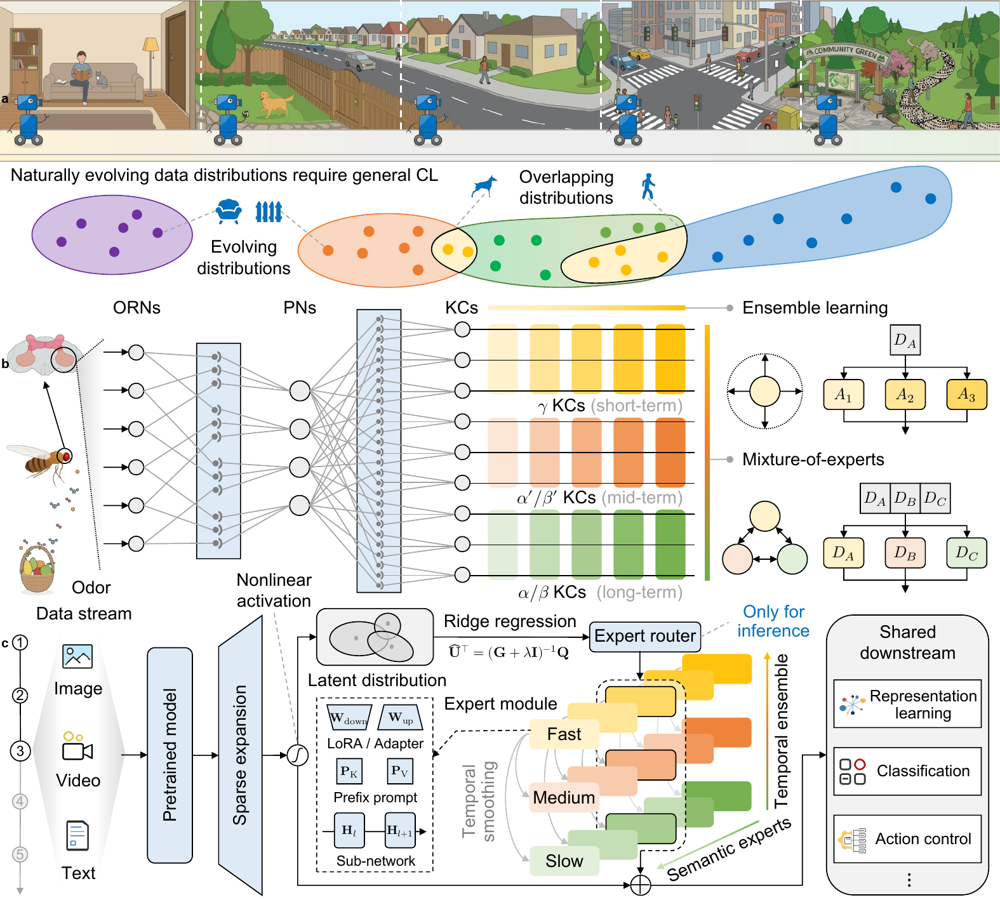

<div align="center">

# FlyGCL

### Brain-inspired hierarchical modularity for general continual learning

**One framework · four learning scenarios · pretrained models under online, uncertain, and evolving experience**

[Repository map](#repository-map) · [Quick start](#quick-start)

</div>

<p align="center">
  
</p>

---

FlyGCL is a lightweight framework for general continual learning (GCL). Inspired by the hierarchical organization of learning and memory in *Drosophila*, it combines instance-level expert routing with spatially and temporally diversified prediction modules. A relatively stable pretrained backbone provides the shared representation, while parameter-efficient experts specialize and their predictions are integrated across complementary timescales.

This repository collects FlyGCL implementations across four application scenarios, together with a controlled olfactory model for the biological mechanism experiments. Each package is self-contained because its data pipeline, model, dependencies, and evaluation protocol are substantially different.

## At a glance

| Scenario | Backbone / model | FlyGCL module | Benchmarks |
|---|---|---|---|
| 🖼️ [Visual recognition](visual_recognition/) | ViT-B/16 | Prompt, adapter, or LoRA experts | CIFAR-100, ImageNet-R, CUB-200 |
| 🔤 [Vision-language learning](vision_language/) | CLIP ViT-B/16 | LoRA experts | CIFAR-100, ImageNet-R |
| 🎥 [Ego-exo video understanding](egoexo_video/) | Video feature encoders | Adapter experts | EgoExoLearn skill assessment and action anticipation |
| 🤖 [Vision-language-action learning](vision_language_action/) | DiT flow-matching policy | Adapter experts | Continual LIBERO manipulation |

The [biological mechanism experiments](biological_mechanism/) use a fixed FlyWire-informed ORN–PN–KC encoder to isolate spatial expert specialization and multi-timescale integration under controlled continual odor streams.

## Repository map

```text
FlyGCL/
├── biological_mechanism/    # Controlled Drosophila olfactory experiments
├── visual_recognition/       # Online Si-Blurry image recognition
├── vision_language/          # Continual CLIP adaptation
├── egoexo_video/             # EgoExoLearn skill and anticipation pipelines
└── vision_language_action/   # Online GCL and offline CL on LIBERO
```

The directories are independent experiment packages. Create a separate environment for each one; there is intentionally no repository-wide `requirements.txt`.

## Quick start

Clone the repository and enter the scenario you want to reproduce:

```bash
git clone https://github.com/THU-NeuroML/FlyGCL.git
cd FlyGCL
```

Then follow the corresponding guide:

1. [Visual recognition guide](visual_recognition/README.md)
2. [Vision-language guide](vision_language/README.md)
3. [Ego-exo video guide](egoexo_video/README.md)
4. [Vision-language-action guide](vision_language_action/README.md)
5. [Biological mechanism guide](biological_mechanism/README.md)

Each guide describes the preparation, paths, and experiment entry points supported by its implementation.

## License

This project is released under the [MIT License](LICENSE).
